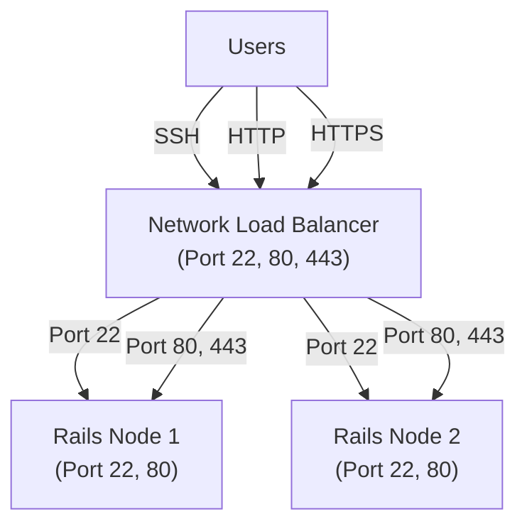
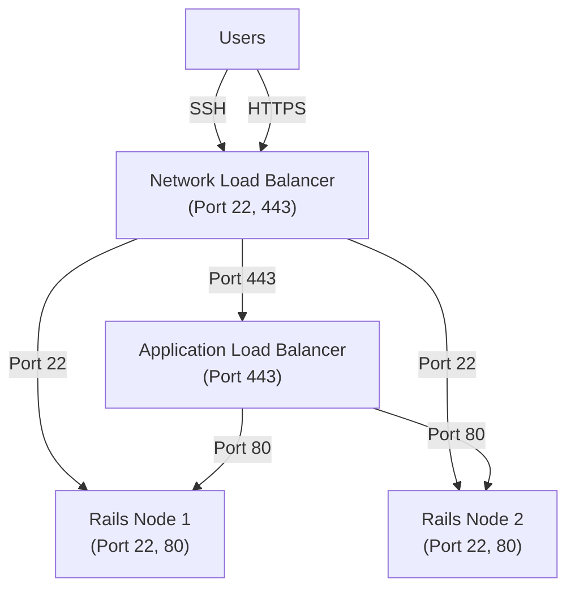

## Summary

[GitLab's AWS POC documentation](https://docs.gitlab.com/install/aws/) was still 
using the AWS Classic Load Balancer however this has already been deprecated 
for a while now. GitLab's [Load Balancer documentation](https://docs.gitlab.com/administration/load_balancer/) 
doesn't quite mention if it supported Network Load Balancers (NLBs) so I took the 
initiative to test the architecture and update the whole documentation accordingly.

## Context

For the longest time we were only referencing 
[AWS’s Classic Load balancers](https://gitlab.com/gitlab-org/gitlab/-/work_items/393308) 
however more and more customers were exploring and deploying with Network Load Balancers 
and were not sure how to implement them. 

## Details

While we only see the final product in the documentation, I went through the process of 
exploring the solution by setting up the POC in AWS, validating the options for the customers, 
looking at potential gotchas, and publishing the supported path. 

- [Update AWS POC to suggest NLB](https://gitlab.com/gitlab-org/gitlab/-/merge_requests/147218)

Multiple documentation sections required updates since AWS Classic LB configuration differs 
significantly from Network LB setup. The revised documentation now clearly demonstrates our 
support for NLBs and associated features like Proxy Protocol to our customers.

As a bonus we eventually added hybrid support later on.

- [Add hybrid NLB/ALB approach](https://gitlab.com/gitlab-org/gitlab/-/merge_requests/218700)

### NeLwork Load Balancer (NLB)

The NLB handles all the traffic to the rails nodes.

### NeLwork Load Balancer (NLB) and Application Load Balancer

In this setup, the NLB handles all TCP traffic while the ALB handles the HTTP/HTTPS traffic to the rails nodes.

This gave users concrete examples on what configurations they can use.

## References

- [AWS POC documentation](https://docs.gitlab.com/install/aws/)
- [Update AWS POC to suggest NLB](https://gitlab.com/gitlab-org/gitlab/-/merge_requests/147218)
- [Add hybrid NLB/ALB approach](https://gitlab.com/gitlab-org/gitlab/-/merge_requests/218700)